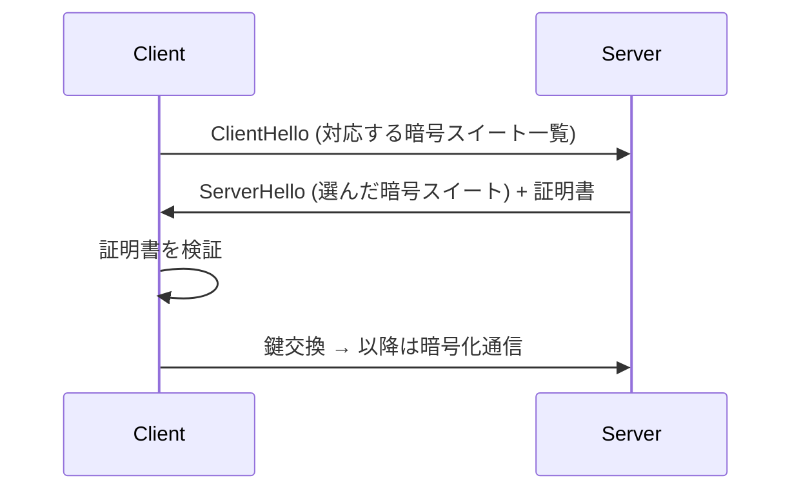

# メンタルモデルを掴むための本を書く

「TLS」「Service Mesh」のような概念は、断片的な知識はあっても腹落ちしていないことが多い。このスキルは、その概念を **体系立てた入門書（md の集合）** として書き下ろし、読者がメンタルモデルを掴めるようにする。

肝は **いきなり書き始めないこと**。読者の現在地を知らずに書いた本は、簡単すぎるか難しすぎるかのどちらかになる。まず対話で理解度を測り、アジェンダを合意し、数章書いてフィードバックを受けてから残りを書く。

## ワークフロー

```
Phase 0: ゴールの確認（任意）
  ↓
Phase 1: 理解度のディスカッション（何往復かする）
  ↓
Phase 2: アジェンダの提案と合意
  ↓
Phase 3: 最初の数章を執筆 → フィードバック
  ↓
Phase 4: 残りの章を執筆
```

各 Phase は**ユーザーの合意を得てから次に進む**。特に Phase 1〜3 は勝手に先へ進めない。

### Phase 0: ゴールの確認（任意）

その概念を理解して**何をしたいのか**を最初に聞く。ゴールがあると本の深さと範囲が定まる。

- 「特にこういう場面で使うから理解したい」
- 「この文章／このコードを読めるようになりたい」（対象を貼ってもらう）
- 「なんとなく全体像を掴みたいだけ」

具体的な対象（理解したい文章・仕様・コード）があれば貼ってもらう。それが本の**到達点**になる。ゴールが「なんとなく」でも構わない — その場合は標準的な入門書として組む。

### Phase 1: 理解度のディスカッション（何往復かする）

**ここを飛ばさない。** 書く前に読者の現在地を知るのが、このスキルの中心。

以下のような問いを投げて、**何往復か対話する**。一度に全部聞かず、返答を見て次を掘る。

- その概念について、いま説明できることは何か（自分の言葉で1〜2文もらう）
- 隣接する概念にどれくらい馴染みがあるか（例: TLS なら「公開鍵暗号」「ハッシュ」「TCP」をどこまで知っているか）
- どこで詰まっているか / 何が「わからない」のか
- 普段の技術的バックグラウンド（何を書く人か、どのレイヤーが得意か）

返答から、**読者のレベルを見立てる**:

- 前提としてよい語彙は何か（説明を省いてよいもの）
- 逆に必ず説明すべき土台は何か
- どこに一番の「わからなさ」があるか（本の重心をそこに置く）

見立てをユーザーに**言語化して返し**、「この理解でいいか」を確認する。ズレていたら往復を続ける。

### Phase 2: アジェンダの提案と合意

レベルが掴めたら、**章立て（アジェンダ）を提案する**。各章について次を1行ずつ書く:

- 章タイトル
- その章で掴んでほしいこと（1文）

あわせて、**踏み込みの度合い**を明示的に聞く:

- どこまで踏み込むか（概念の直感 止まりか、プロトコルの詳細やコードレベルまでか）
- 何を範囲外にするか（例: 「暗号アルゴリズムの数学的証明はやらない」）
- 章数と分量感（後述の目安を提示）

アジェンダに OK が出るまで直さない。**ここで合意した範囲が本の輪郭**になる。

### Phase 3: 最初の数章を執筆 → フィードバック

**いきなり全部書かない。** まず最初の2〜3章だけ書いて、ユーザーに読んでもらう。

- 文体・深さ・図の粒度が好みに合っているか
- 難易度が合っているか（簡単すぎ / 難しすぎ）
- 具体例やコードの量は適切か

フィードバックを反映して、以降の章のトーンを固める。ここで方向を合わせておくと、残りの章の手戻りが減る。

### Phase 4: 残りの章を執筆

固まったトーンで残りを書く。書き進める中で章立ての見直しが必要になったら、その都度ユーザーに相談する。

## 出力

- **出力先**: 基本的に**カレントディレクトリ**に本用のディレクトリを1つ作る。ディレクトリ名は概念のスラッグ（例: `tls-book/`、`service-mesh-book/`）。ユーザーが場所を指定したらそれに従う。
- **構成**: 章ごとに md ファイルを分ける。

```
<concept>-book/
  README.md        # 本のタイトル・対象読者・ゴール・目次（各章へのリンク）
  ch01.md
  ch02.md
  ...
```

- `README.md` には、本のタイトル・**想定読者（Phase 1 の見立て）**・ゴール・章一覧（各章1行説明つき）を書く。

## 執筆のルール

### 1章の分量

- **1章あたり日本語で 3000〜4000字程度**（mermaid のコードもこの字数に含めて考える）。
- 字数は目安。図が多い章は文章が短くなるので、**読んで1つのまとまりとして腹落ちするか**を優先し、機械的に字数を埋めない。
- 1章が膨らみすぎたら分割する。

### mermaid で図解する

概念の構造・流れ・関係は **mermaid で図にする**。文章だけで説明しない。

- 逐次的なやり取り（ハンドシェイク等）→ `sequenceDiagram`
- 構成要素の関係 → `flowchart` / `graph`
- 状態遷移 → `stateDiagram-v2`

図は「なんとなく雰囲気」ではなく、**その章の主張を一目で掴ませる**ものにする。図の直後に、図の読み方を1〜2文添える。

例:



### 具体例・コードを入れる

抽象的な説明だけで終わらせず、**具体例や動くコード**で支える。

- コードは**その場で読んで意味が追える最小サイズ**にする。フレームワークの設定を延々と貼らない。
- 実在の業務コードや特定リポジトリの内容を**持ち込まない**。一般的・普遍的な例に落とす（機密や社内固有の話は本に書かない前提で組む）。
- コード例には、それが概念のどの部分を示しているのかのキャプションを添える。

### 用語の初出

前提としてよい語彙（Phase 1 で合意したもの）は説明を省く。それ以外の用語は**初出時にその場で短く定義**する。読者が「これ何だっけ」で止まらないようにする。

### 視点・文体

- 「理解した人が、これから学ぶ人に噛み砕いて説明する」目線で書く。
- 一足飛びに結論を置かず、**なぜそれが必要なのか（動機）→ どう解決するか（仕組み）** の順で積む。概念は、それが解いている問題から入ると腹落ちしやすい。

## 公開可能性への配慮

このスキルの出力 md は**そのまま公開できる一般的な内容**であることを前提に書く。

- 特定の業務リポジトリ・社内システム・機密情報に言及しない。
- 例やコードは普遍的な題材で作る。ユーザーが「どこが業務固有でどこが一般論か」を後で判別しなくて済むよう、**最初から業務の話を混ぜない**。

## チェックリスト（各章を書き終えたら）

- [ ] Phase 1〜3 の合意を飛ばして先に進んでいないか
- [ ] 1章が 3000〜4000字程度に収まっているか（超えたら分割を検討）
- [ ] mermaid 図が入っていて、章の主張を一目で掴ませるか
- [ ] 具体例・コードが入っていて、最小サイズで意味が追えるか
- [ ] 業務リポジトリ・機密固有の内容が混じっていないか
- [ ] 動機（なぜ必要か）→ 仕組み（どう解くか）の順になっているか
- [ ] 前提外の用語を初出時に定義しているか

## 一発で完璧を目指さない

このスキルは**対話とフィードバックで仕上げる**もの。最初の数章で方向を合わせ、読者の反応を見ながら深さを調整する。書き始める前の Phase 1〜2 に時間をかけるほど、後の手戻りが減る。
